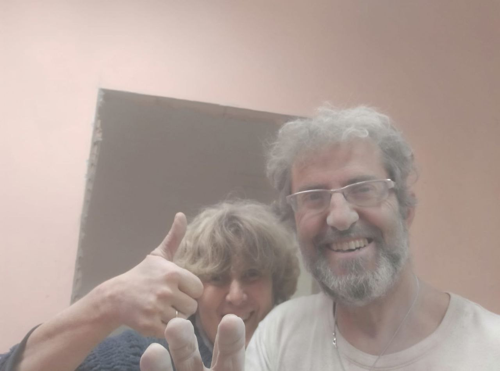
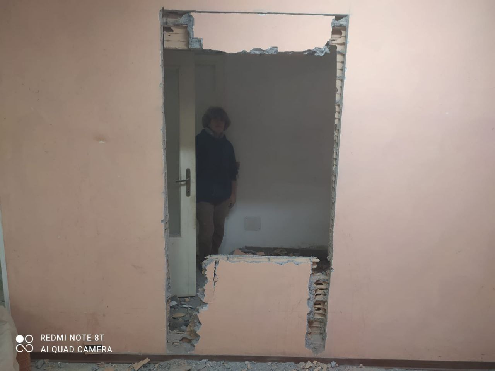
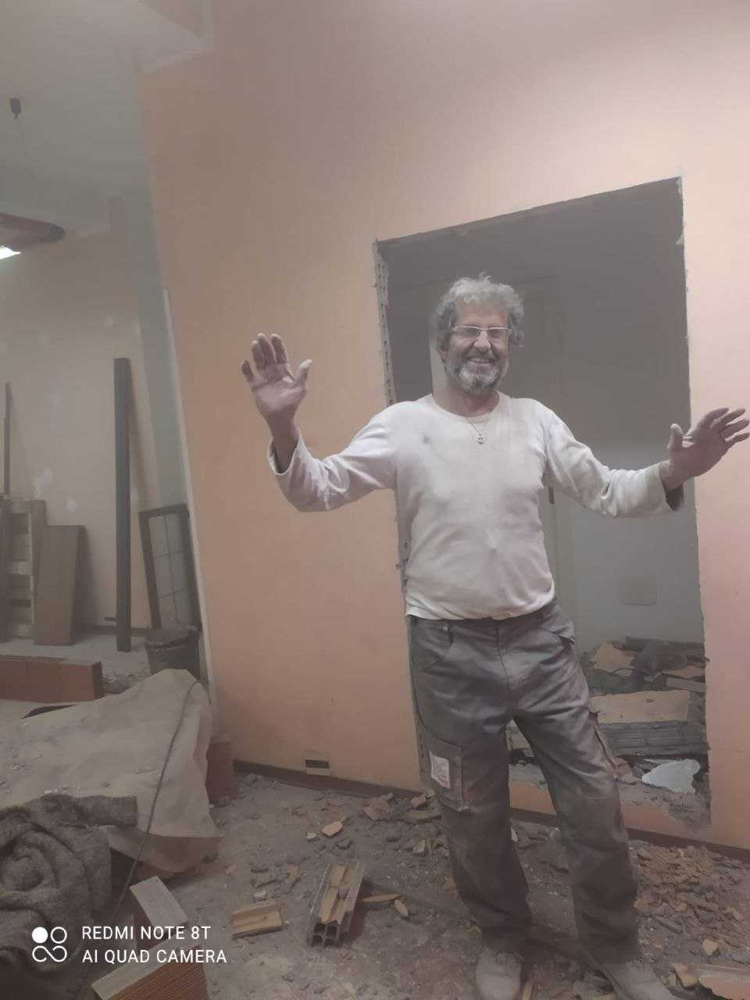
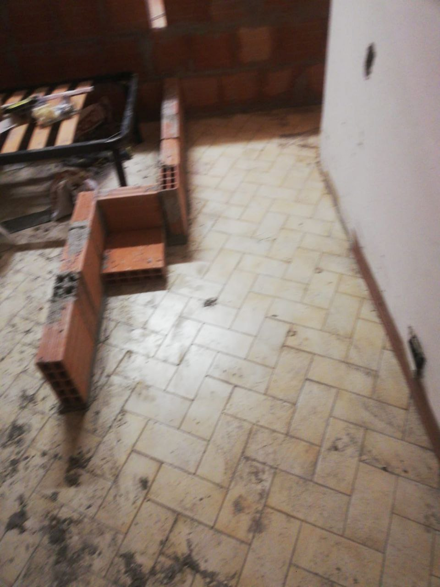
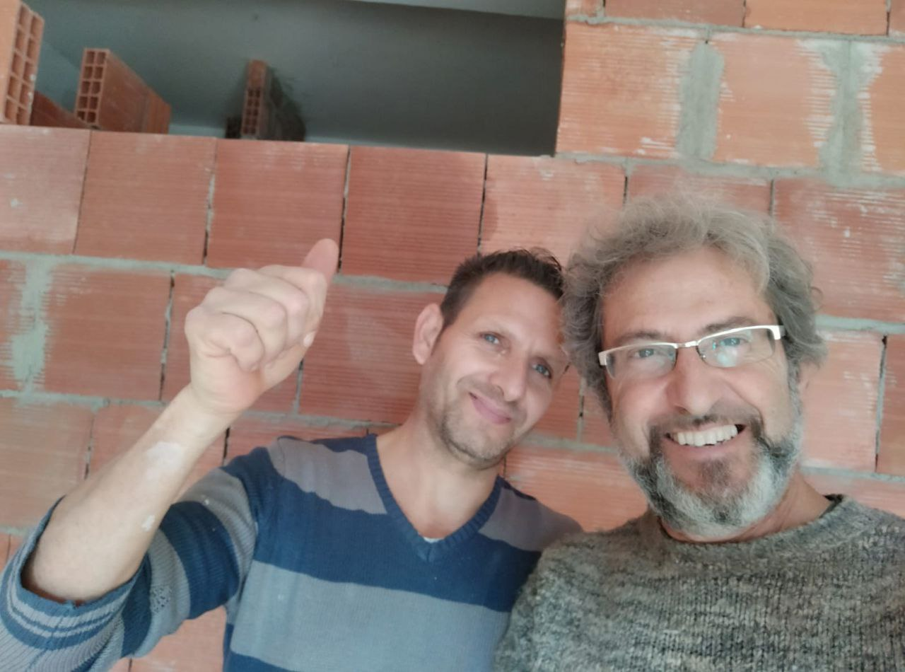
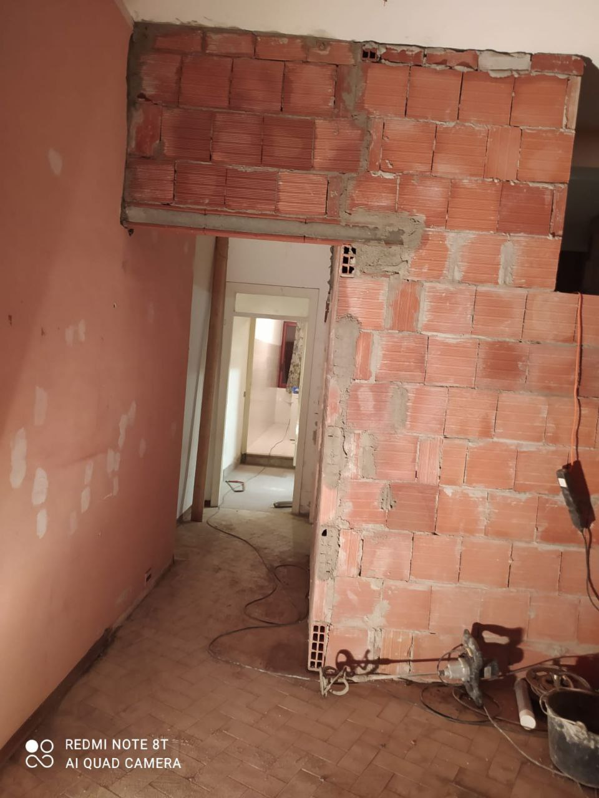
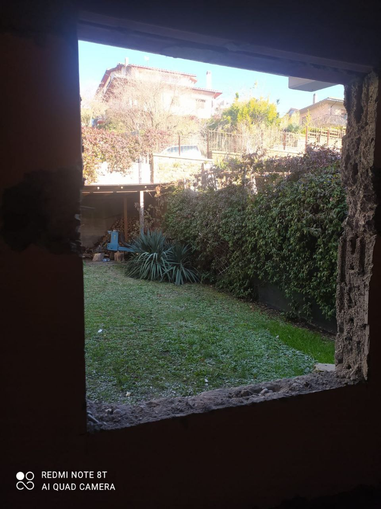

# Lavori

Stiamo lavorando alla costruzione delle camere, oltre che del sito.

<figure>
  
  <figcaption> Noi impolverati ma felici.
  </figcaption>
</figure>

<figure>
  
  <figcaption> Giuliana che valuta l'apertura della porta.
  </figcaption>
</figure>

<figure>
  
  <figcaption> Porta aperta!
  </figcaption>
</figure>

<figure>
  
  <figcaption> Un accenno di tramezzi.
  </figcaption>
</figure>

<figure>
  
  <figcaption> Un saluto dal grande Costantino!
  </figcaption>
</figure>

<figure>
  
  <figcaption> Inizia ad apparire il corridoio..
  </figcaption>
</figure>

<figure>
  
  <figcaption> Una finestra sul cortile.
  </figcaption>
</figure>